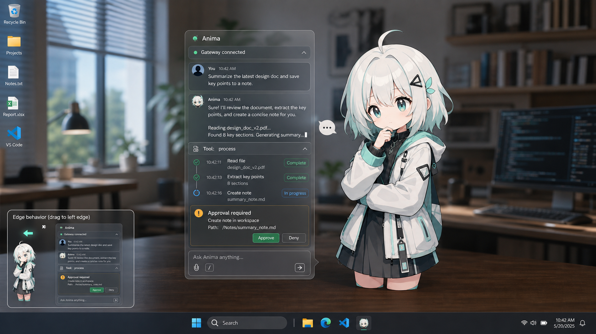

# Anima 桌宠执行计划

版本：v0.1 draft  
日期：2026-05-10  
面向对象：后续实现 Agent

## 视觉目标

当前概念图：

关键约束：

- Live2D 角色是独立透明桌宠，角色背后不能有应用框、标题栏或背景面板。
- 对话框默认浮在角色左侧，并且要靠近角色，让用户感知到“正在和桌宠对话”。
- 对话框和角色之间允许使用轻量 speech-tail、细线或空间贴近来表达关联，但不要做营销页式 hero。
- 当角色被拖到屏幕左侧边缘时，对话框自动切换到角色右侧，避免被屏幕裁切。

## 已确认决策

- 旧项目 `D:\coding\project\Anima` 弃用，不作为实现基础。
- `D:\coding\project\Copiwaifu` 只作为架构、交互和资源参考；所有需要的代码与资源必须复制到当前 Anima 项目内。
- Gateway 协议以当前仓库的 [gateway-api-guide.md](../../gateway-api-guide.md) 为准。
- v0.1 使用 OpenClaw Gateway 的流式 `agent` 事件展示回复与工具状态。
- 默认 Gateway URL 是 `ws://localhost:18789`。
- Gateway URL、token、session key 在设置页手动配置。
- v0.1 只接一个 session。
- TTS 放在最后阶段，前置体验稳定后再做。

## 产品范围

v0.1 目标是一个可用的桌面 Agent 桌宠，而不是完整 Agent 平台。

必须完成：

- 透明桌宠窗口，显示 Live2D 模型。
- 独立浮动对话框窗口，和桌宠保持贴近。
- OpenClaw Gateway 连接、认证、断线重连和状态展示。
- 单 session 聊天、历史加载、消息发送、中止当前回复。
- 流式助手回复展示。
- 工具调用 timeline 展示。
- 审批请求展示与同意/拒绝。
- Gateway 事件驱动 Live2D 动作。
- 设置页配置 Gateway URL、token、session key、模型、动作映射。

暂缓：

- 多 session 管理。
- TTS 和口型同步。
- 长期记忆。
- 复杂任务编排。
- 远程 Gateway 安全隧道配置。

## 窗口架构

采用两个 Tauri window：

- `pet`：透明、无边框、置顶、可拖动，只承载 Live2D 角色和极少量状态提示。
- `chat`：透明/半透明、无边框、置顶，承载对话、工具、审批和输入框。

推荐理由：

- 避免一个超宽透明 WebView 覆盖桌面，影响桌面点击。
- 对话框可以独立贴边、隐藏、调整位置。
- 后续更容易做点击穿透、窗口吸附和多显示器适配。

窗口跟随规则：

- `chat` 默认位于 `pet` 左侧。
- 两个窗口之间保留小间距，建议 8 到 20 px。
- 当 `chat` 左边界小于当前显示器 work area 左边界时，切换到 `pet` 右侧。
- 当 `chat` 右边界超过当前显示器 work area 右边界时，切回 `pet` 左侧。
- 上下方向要 clamp 到当前显示器 work area 内。
- `pet` 移动时，`chat` 以节流方式跟随，避免抖动。

## 技术栈

建议：

- Tauri 2
- Vue 3
- TypeScript
- Rust
- PixiJS
- `easy-live2d`

Copiwaifu 可参考点：

- Tauri 透明窗口、置顶、托盘、设置窗口。
- `easy-live2d` + PixiJS 的模型加载方式。
- motion group 扫描和状态到动作组绑定。
- Live2D 自定义模型目录导入逻辑。

不要直接依赖 Copiwaifu 路径。实现时需要复制所需资源和必要代码，并在项目许可证说明里保留来源与许可证。

## 内置模型与资源

v0.1 默认复制 Copiwaifu 的：

- `public/Resources/Yulia`
- `public/Core`

资源要求：

- 复制后路径应位于 Anima 仓库内，例如 `public/Resources/Yulia` 和 `public/Core`。
- 保留 Copiwaifu 根 LICENSE 的 MIT 版权声明。
- 保留 `public/Core/LICENSE.md`、`README.md`、`RedistributableFiles.txt` 等 Live2D Cubism Core 许可证文件。
- 在 Anima 的第三方声明中写明：本项目参考 Copiwaifu，并使用/改写了其 MIT 许可下的部分实现思路和资源组织。

## Gateway 连接

Tauri/Rust 后端持有 token，不把 token 暴露给前端业务代码。

设置项：

- `gatewayUrl`，默认 `ws://localhost:18789`
- `gatewayToken`
- `sessionKey`，默认 `agent:main:main`
- `autoConnect`

连接流程：

1. 连接 Gateway WebSocket。
2. 等待 `connect.challenge`。
3. 调用 `connect`，client 使用 backend 模式。
4. scopes 至少包含 `operator.read`、`operator.write`、`operator.approvals`。
5. 拉取 `agent.identity.get`。
6. 使用 session 策略确定 v0.1 session。
7. 订阅消息和会话变化。
8. 持续监听 `agent`、`session.message`、`session.tool`、`chat`、`exec.approval.requested`、`exec.approval.resolved`、`health`、`shutdown`。

session 策略：

1. 优先使用设置中的 `sessionKey`。
2. 如果为空，默认 `agent:main:main`。
3. 如果目标 session 不可用，调用 `sessions.list` 取第一个可用 session。
4. 如果列表为空，调用 `sessions.create`。

发送策略：

- v0.1 默认使用 `sessions.send`。
- 如果后续需要模型、system prompt 或更强幂等控制，再使用 `chat.send`。
- 中止当前回复使用 `chat.abort` 或文档中可用的中止方法。

## Gateway 事件映射

优先级：

1. `agent` stream 事件。
2. `session.tool`。
3. `session.message.content` 的 content blocks 兜底。
4. `chat` 状态兜底。

映射建议：

| Gateway 输入 | Anima 状态 | 前端表现 |
| --- | --- | --- |
| `agent stream=lifecycle phase=started` | `thinking` | 角色进入思考，输入框进入 running |
| `agent stream=assistant delta` | `answering` | 对话框逐 token 追加文本，角色进入说话动作 |
| `agent stream=item phase=start kind=tool` | `tool_running` | timeline 新增工具项，角色进入工具动作 |
| `agent stream=item phase=end status=completed` | `thinking` 或 `answering` | 工具项完成，等待下一段输出 |
| `agent stream=item status=error` | `error` | 工具项标红，角色错误动作 |
| `agent stream=lifecycle phase=completed` | `success` | 本轮完成，短暂停留后回 idle |
| `agent stream=lifecycle phase=error` | `error` | 显示错误并保留重试入口 |
| `session.message role=user` | `reading_input` | 消息列表追加用户消息 |
| `session.message role=assistant` | `success` | 完整消息补齐或校正流式结果 |
| `chat state=processing/delta` | `thinking` 或保持当前 running 状态 | 兜底运行状态 |
| `chat state=final` | `success` | 本轮结束 |
| `exec.approval.requested` | `needs_attention` | 显示审批卡片，角色进入提醒动作 |
| `exec.approval.resolved` | `thinking` 或 `success` | 审批卡片更新状态 |
| `health/shutdown/error` | `offline` 或 `error` | 顶部连接状态更新 |

审批：

- 收到 `exec.approval.requested` 后，在对话框中展示审批卡片。
- 同意/拒绝调用 `exec.approval.resolve`。
- 参数包含 `id` 和 `decision`，`decision` 为 `"approve"` 或 `"deny"`。
- 连接 scope 需要包含 `operator.approvals`。

## Live2D 动作状态

v0.1 状态表：

| 状态 | 用途 | 推荐 motion group |
| --- | --- | --- |
| `idle` | 空闲 | `Idle` |
| `thinking` | Agent 正在规划/处理 | `Thinking` |
| `tool_running` | 工具执行中 | `ToolUse` |
| `answering` | 助手流式输出 | `Thinking` 或后续新增 Talk |
| `success` | 当前轮完成 | `Completed` |
| `error` | 执行失败 | 暂无时回退 `Thinking` |
| `needs_attention` | 等待用户审批 | 暂无时回退 `ToolUse` |
| `offline` | Gateway 不可用 | `Idle` |

动作调度要求：

- 状态切换必须有优先级，`needs_attention` 和 `error` 高于工具与回答。
- 非 idle 动作应有最短展示时间，避免快速闪烁。
- 工具和审批状态不能被普通文本 delta 立刻打断。
- 完成状态展示短时间后回 idle。
- 允许用户在设置页为状态绑定 motion group。

## 对话框信息结构

对话框必须包含：

- 顶部连接状态：Gateway connected / reconnecting / offline。
- 消息列表：用户消息、助手流式消息。
- 工具 timeline：工具名称、状态、开始/结束、错误。
- 审批卡片：动作说明、路径/命令等详情、Approve、Deny。
- 输入区：文本输入、发送按钮、停止按钮。

UI 约束：

- 信息密度要像工作型 Agent 工具，不做 landing page。
- 卡片圆角控制在 8px 左右。
- 不要卡片套卡片。
- 文本必须在小尺寸下可读，不溢出按钮或容器。
- 对话框和角色的空间关系优先于装饰效果。

## 实施里程碑

### M0 文档与脚手架

- 建立 Tauri 2 + Vue 3 + TypeScript 项目。
- 加入 Copiwaifu 来源说明和第三方许可证占位。
- 复制 Live2D 默认资源。

验收：

- `pnpm tauri dev` 能启动空透明窗口。
- 仓库内能找到模型资源和许可证说明。

### M1 透明桌宠窗口

- 加载 Yulia Live2D 模型。
- 实现无框透明、置顶、拖动。
- 实现基础 motion group 扫描。

验收：

- 桌面上只看到角色，不看到角色背后的应用框。
- idle 动作正常。

### M2 对话框窗口与跟随定位

- 新增 `chat` window。
- 实现默认左侧贴近角色。
- 实现屏幕边缘自动切换。
- 实现基础连接状态和输入框 UI。

验收：

- 拖动角色到屏幕左侧时，对话框切到右侧。
- 对话框不会被屏幕裁切。

### M3 Gateway Bridge

- Rust 后端实现 Gateway WebSocket 客户端。
- 完成 connect challenge 认证。
- 实现 settings 持久化。
- 实现单 session 策略。
- 前端只接收脱敏后的连接状态、消息、工具和审批事件。

验收：

- 手动配置 URL/token 后可以连接 Gateway。
- 能拉取历史并发送消息。

### M4 流式 Agent 体验

- 处理 `agent stream=assistant`。
- 处理 `agent stream=item`。
- 处理 `agent stream=lifecycle`。
- `session.message` 用于最终消息补齐。
- 对话框显示流式文本和工具 timeline。

验收：

- 助手回复逐 token 显示。
- 工具调用开始/结束可见。
- chat final 后当前轮正确结束。

### M5 审批与状态动作

- 处理 `exec.approval.requested/resolved`。
- 调用 `exec.approval.resolve`。
- 接入动作调度器。
- 实现状态到 Live2D motion 的绑定。

验收：

- 审批卡片可以同意/拒绝。
- 工具、回答、审批、错误能触发不同桌宠动作。

### M6 设置、托盘与打包

- 设置页：Gateway、session、模型、动作映射。
- 托盘菜单：显示/隐藏、打开设置、退出。
- 基础打包配置。

验收：

- 重启后配置保留。
- 无 Gateway 时能清楚提示配置问题。

### M7 TTS

- 检查 `tts.status`。
- 调用 `talk.speak` 或 `tts.convert`。
- 播放语音。
- 后续再考虑口型同步。

验收：

- 助手完成回复后可以朗读。
- TTS 不影响核心聊天和动作状态。

## 风险与注意事项

- Gateway 文档注明可能与实际存在误差，实现时要以真实 `hello-ok.features.methods/events` 做能力检测。
- 浏览器直连 Gateway 可能受权限限制，所以 token 和 WebSocket 连接应在 Tauri 后端。
- 透明窗口在 Windows、macOS、Linux 的点击穿透、置顶和多显示器行为不同，需要逐平台验证。
- Live2D 效果取决于模型已有 motion。Yulia 当前具备 Idle、Thinking、ToolUse、Completed，error/approval/talk 需要 fallback 或后续补动作。
- 不要把 token 硬编码进前端构建产物。

